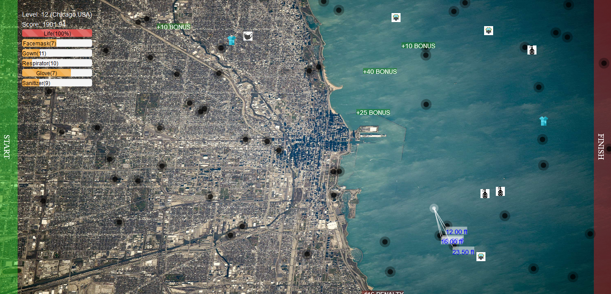

# ISO(Isolation) - A COVID-19 Game
ISO is a game that provides an interactive learning environment so that people can better understand what to do to avoid getting infected and to stop the spread of COVID-19.  
Hope you enjoy it.  

Explanation
-----------
The white node represents the player(you).  
The black(sometimes purple) nodes represents people infected with COVID-19.  
The player must move across the city from the left edge of the screen to the right edge of the screen whiles observing all social distancing protocols and arming himself with PPEs. 
The level is complete when the player touches the right wall of the game screen 
Move across the canvas with your keyboard arrow keys.  
Pause the game by pressing the ESC button on your keyboard. 

 
## Getting Started

These instructions will get you a copy of the project up and running on your local machine for development and testing purposes. 

### Prerequisites

All you'll ever need is a working web browser. That's it.

### Installing
Open the index.html file in your web browser. It's that simple. Enjoy the game.  
 
## Built With

* Javascript 
* jQuery
* Twitter Bootstrap : https://getbootstrap.com/
* Select2 : https://select2.org/  

## Authors 

* **Caleb Nii Tetteh Tsuru Addy**
* **Allswell Nii Feehi Addy**   
 
## License

This project is licensed under the GNU General Public License v3.0.
